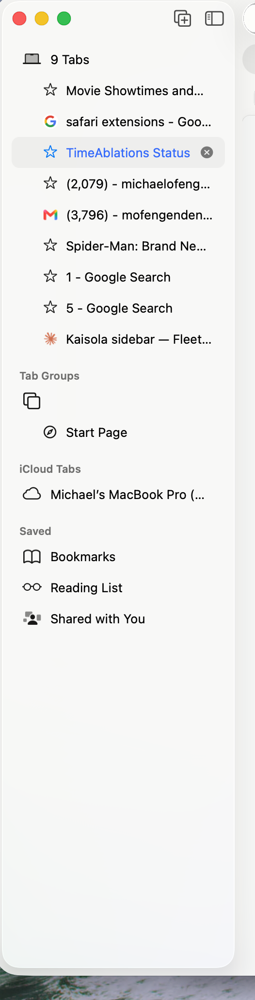

# Backlog

I want to make a few edits to kaisola. First the lefthandside bar, whenever  a window tab project is highlighted, I want to get rid of the color highlighted way, let's bold it instead, I prefer just the indent to be big and the session tab that is currently shown to be colored in blue kind of like in this screenshot (showing safari(lefthandsidebar). also please fix the codex icon to be the real chatgpt icon! (find from the internet if need be, I also pasted an image, also we need to fix the claude icon,  it's not recognizing claude cli from the terminal and nor is it orange or whatever the claude symbol color is).  also the tinted canvas settings should actually be tinted or a white slolid! .also for somereason the lefthandsidebar gets scrolled up so that the first project window dissapears... 

In general, the background in dark mode looks bad, it needs to be much more like the sidebar mockup, where it's really glass dark not purple/blue the way it looks now. glass needs to be glassy/smooth/trnaslucent to the wall paper. Also editing md files is very annoying. it keeps jumping me to the top, and I don't like how I have to edit preview md files block by block. I want to have a smooth lesswrong/google docs experience editing md files.

the top is waste space as it has two buttons the file preview button and the filetree buton, mabe let's put them elsewhere or fit them somewhere else so the top is not taken away?
