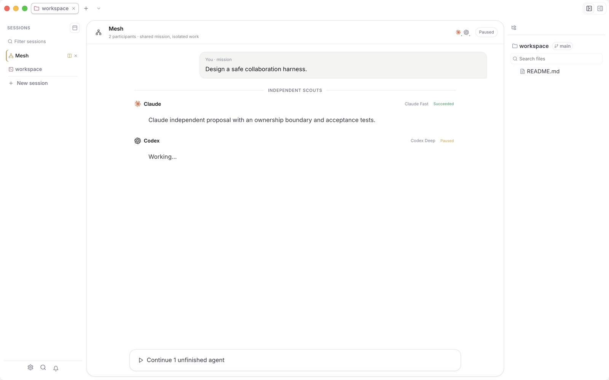

<p align="center">
  
</p>

<h1 align="center">Kaisola</h1>

<p align="center">
  <strong>Your agents. One controlled workspace.</strong><br />
  Direct Codex and Claude, run real terminals, and coordinate cross-provider teams.
</p>

<p align="center">
  <a href="https://kaisola.com">Website</a> ·
  <a href="https://github.com/michaelofengenden/kaisola/releases/latest/download/Kaisola.dmg">Download for macOS</a> ·
  <a href="https://github.com/michaelofengenden/kaisola/releases">Releases</a> ·
  <a href="docs/">Docs</a>
</p>



Kaisola gives provider-native agent sessions, real CLIs, terminals, and files a
single inspectable surface. Run one agent directly or give a Kaisola Mesh one
mission. You can stop the team, preserve completed work, and continue only the
unfinished participants after a reload or restart.

It is free and open source. The current desktop build targets **macOS 13+ on
Apple Silicon**.

## What is inside

- **Codex and Claude over ACP.** Structured conversations include tool activity,
  plans, permission requests, durable queued follow-ups, provider models and
  effort, and resumable session IDs.
- **Kaisola Mesh.** Coordinate bounded cross-provider teams with durable
  stop/continue, isolated git worktrees, cross-review, and single-owner
  integration.
- **Real terminals.** Interactive shells run through `node-pty`, so colors,
  prompts, and terminal programs behave like they do in your normal shell.
- **Project workspace.** Browse and search files, edit source, inspect diffs,
  and preview documents without leaving the agent sessions doing the work.
- **Flexible session layout.** Keep sessions in the default vertical rail, move
  them across the top, split them side by side, and resize the surrounding UI.
- **Markdown and LaTeX.** Edit GitHub-flavored Markdown in a clean rendered
  surface; build LaTeX locally, read parsed errors, and inspect the PDF output.
- **MCP and extensions.** Carry configured MCP servers into supported agent
  sessions and install language, grammar, preview, and MCP contributions from
  Settings.
- **Local recovery.** Project state, layouts, drafts, and session metadata are
  persisted to disk so the workspace can recover after a restart.

## Kaisola Mesh

A Mesh is a bounded multi-agent collaboration protocol, not an unstructured room
where several models edit the same checkout. Start with Claude and Codex, add up
to six participants, and choose each agent's live provider model and effort:

1. Every participant scouts the task independently.
2. They compare approaches, risks, interfaces, and acceptance criteria.
3. A role contract gives each subsystem or file boundary one owner.
4. You approve the plan before execution begins.
5. Each agent implements its assignment in an isolated git worktree.
6. The agents cross-review the exact candidate changes in a verification ring.
7. You approve integration, then one owner merges and runs final checks.

Human approval remains at every state-changing boundary. Stop snapshots finished
workers and cancels unfinished ones; Continue retries only that unfinished set.
Every stage is journaled, and integration rejects work that drifted beyond the
exact commit reviewed by its peer.

## Local by default

Kaisola coordinates tools installed on your Mac. Codex and Claude use their own
CLI authentication; Kaisola does not proxy those prompts through a separate
Kaisola model service.

Signing into a Kaisola profile with Google is optional. **Continue locally**
keeps the editor, projects, terminals, and configured agents available without
an account. If Google sign-in is used, the durable refresh credential is
encrypted in the Electron main process with OS-backed `safeStorage`; Firebase
tokens are not exposed to the renderer or written into the project workspace.

See [Firebase-backed Google sign-in](docs/google-sign-in.md) for the exact auth
flow and configuration boundaries.

## Install

Download [Kaisola.dmg](https://github.com/michaelofengenden/kaisola/releases/latest/download/Kaisola.dmg)
and drag Kaisola to Applications, or install the latest release from the
terminal:

```sh
curl -fsSL https://kaisola.com/install.sh | sh
```

Kaisola does not install or authenticate coding-agent CLIs for you. Install the
agents you want to use and complete their normal CLI login first.

## Run from source

Requirements: a current Node.js release, npm, and Xcode Command Line Tools on
macOS for native dependencies.

```sh
npm install
npm run electron:dev   # desktop app with terminals and agents
npm run dev            # renderer only at localhost:5173
npm run typecheck      # TypeScript validation
npm run smoke          # production renderer + Electron smoke suite
```

If `node-pty` or `better-sqlite3` needs rebuilding after an Electron update:

```sh
npm run rebuild
```

Additional focused checks include `npm run group:probe` for the full
Kaisola Mesh collaboration lifecycle and `npm run layout:probe` for responsive
session arrangements.

## Release

After verification, stage exactly the changes intended for the release, then
run one command:

```sh
npm run release:fast -- 0.1.64 "Release v0.1.64: concise description"
```

The helper bumps `package.json` and `package-lock.json`, commits the staged
change set, creates the annotated version tag, and atomically pushes `main` and
the tag. Untracked files are never added. The tag starts the signed and
notarized macOS release workflow.

## Repository map

| Path | Purpose |
| --- | --- |
| [`src/`](src/) | React UI, Zustand state, files, sessions, and editor surfaces |
| [`electron/`](electron/) | Electron shell, ACP, terminals, persistence, auth, git, and MCP bridges |
| [`functions/`](functions/) | Firebase server session endpoint for optional profile sign-in |
| [`docs/`](docs/) | Product, architecture, auth, design, and working documentation |
| [`site/`](site/) | Static source for [kaisola.com](https://kaisola.com) |
| [`scripts/`](scripts/) | Packaging, icon, and release helpers |

## Project notes

- [Architecture](docs/ARCHITECTURE.md)
- [Design](docs/DESIGN.md)
- [Product specification](docs/SPEC.md)
- [Roadmap](docs/ROADMAP.md)
- [Working backlog](docs/BACKLOG.md)
