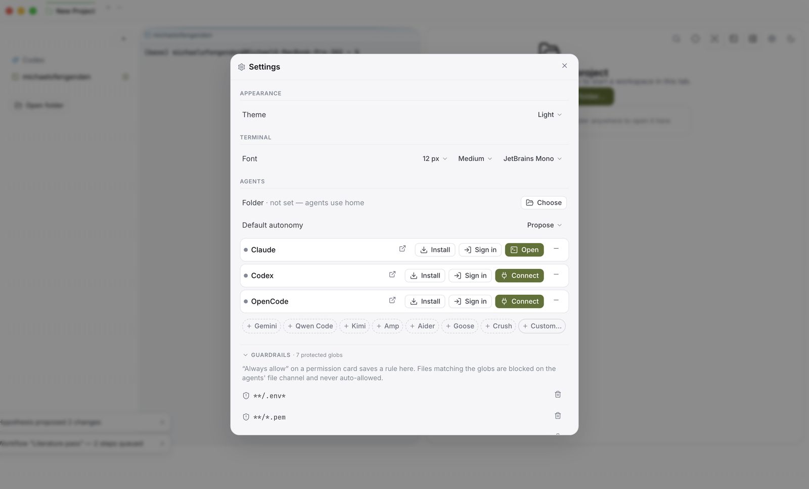
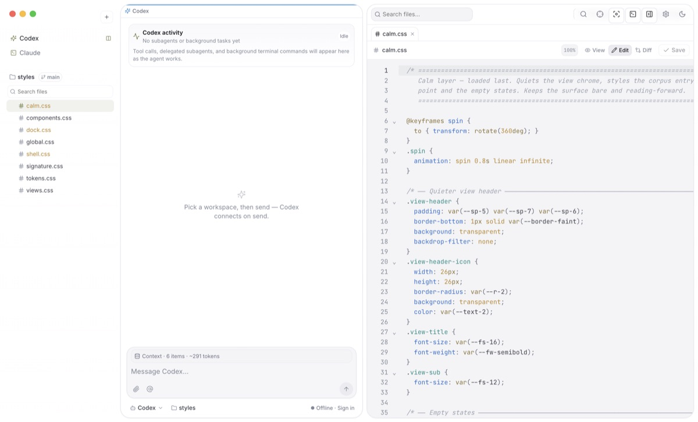

<p align="center">
  
</p>

<h1 align="center">Kaisola</h1>

<p align="center">
  <b>The research IDE that's a browser for AI agents.</b><br />
  Every agent is a tab — <code>claude</code>, <code>codex</code>, <code>gemini</code>, any CLI — side by side on glass,<br />
  with you reviewing every change before it lands.
</p>

<p align="center">
  <a href="https://kaisola.com">kaisola.com</a> ·
  <a href="https://github.com/michaelofengend/kaisola/releases">Download for macOS</a> ·
  <a href="docs/">Docs</a>
</p>

<picture>
  <source media="(prefers-color-scheme: dark)" srcset="site/assets/hero-dark.jpg" />
  
</picture>

Free and open-source. Bring your own agent CLIs — your install, your auth; Kaisola never proxies a model, and keys stay in the macOS keychain.

## Why

- **Sessions are tabs.** Agents, terminals, git panels, and embedded browsers are cards you pin, group, split, and `⌘1–9` between. Projects are tabs too — a Chrome-style strip across the top; agents in background projects keep working.
- **A real IDE underneath.** Real node-pty terminals, stage/commit beside the agent that made the change, checkpoints before every agent turn, LaTeX builds with Overleaf sync.
- **Research that has to hold up.** Every claim links to its evidence and carries a trust level. Agents never mutate your work — they file proposals rendered as research diffs, and you approve every transition.

Keys: `⌘L` talk to any agent · `⌘K` palette · `⌘J` terminals · `⌘,` settings — every chord rebindable.

## Download

[**Download Kaisola.dmg**](https://github.com/michaelofengend/kaisola/releases/latest/download/Kaisola.dmg) (macOS 13+, Apple Silicon — [all releases](https://github.com/michaelofengend/kaisola/releases)) and drag Kaisola to Applications. Not notarized yet — first launch: right-click → Open, or `xattr -cr /Applications/Kaisola.app`.

## Run from source

```bash
npm install
npm run electron:dev   # the desktop IDE — real terminals + agents
npm run dev            # UI only, in a browser at :5173 (no terminals)
npm run smoke          # headless checks
```

If the terminal complains about node-pty after an Electron bump, run `npm run rebuild` once.

## A closer look

| Ten agent CLIs, one `+` menu | A real editor beside your agents |
| :--: | :--: |
|  |  |
| Each preset runs the official CLI with your existing install and auth. Guardrail globs fence off files agents may never read. | Files, diffs, and builds are first-class — the agent's terminal opens beside it, and you can take over anytime. |

## Repo map

| | |
| --- | --- |
| [`src/`](src/) | the app — React + Zustand; [`src/domain/types.ts`](src/domain/types.ts) is the source of truth |
| [`electron/`](electron/) | desktop shell — terminals (node-pty), agents (ACP), git, keychain |
| [`docs/`](docs/) | the design blueprint — SPEC · ARCHITECTURE · DESIGN · ROADMAP |
| [`site/`](site/) | kaisola.com, deployed by [`site.yml`](.github/workflows/site.yml) |
| [`notes/`](notes/) | working notes and plans |

## Docs

- [SPEC](docs/SPEC.md) — positioning, the core loop, anti-goals
- [ARCHITECTURE](docs/ARCHITECTURE.md) — the store, the agent seam, the Electron security model
- [DESIGN](docs/DESIGN.md) — design tokens and the signature components
- [ROADMAP](docs/ROADMAP.md) — phases 0–4, what's real vs stubbed
