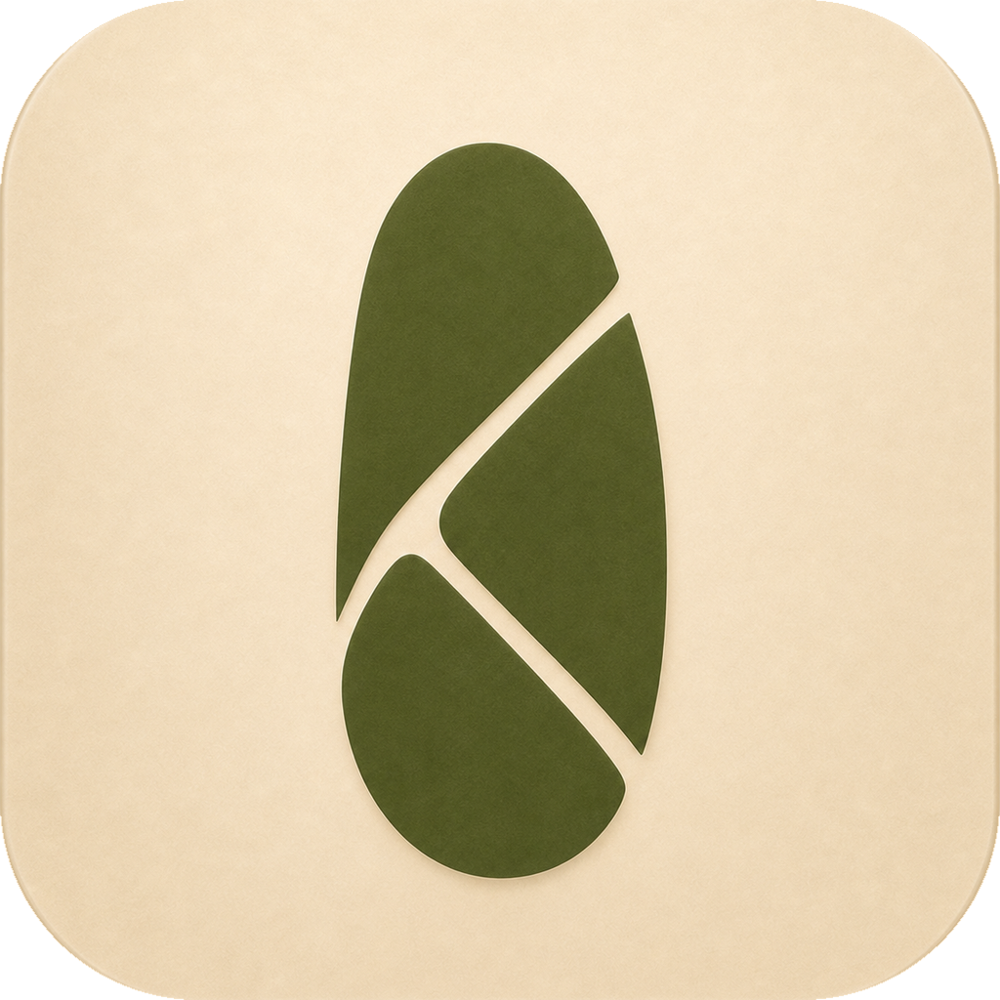
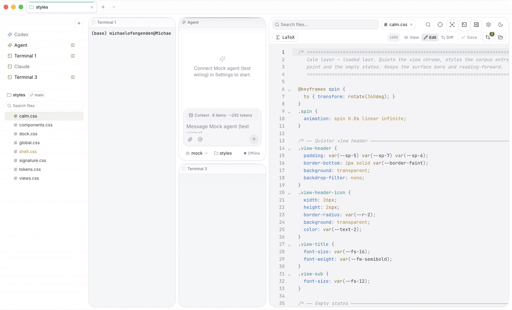

<p align="center">
  
</p>

<h1 align="center">Kaisola</h1>

<p align="center">
  <strong>Files first. Agents alongside.</strong><br />
  A desktop IDE for source files, Markdown, LaTeX, terminals, Codex, and Claude.
</p>

<p align="center">
  <a href="https://kaisola.com">Website</a> ·
  <a href="https://github.com/michaelofengend/kaisola/releases/latest/download/Kaisola.dmg">Download for macOS</a> ·
  <a href="https://github.com/michaelofengend/kaisola/releases">Releases</a> ·
  <a href="docs/">Docs</a>
</p>

<picture>
  <source media="(prefers-color-scheme: dark)" srcset="site/assets/hero-dark.jpg" />
  
</picture>

Kaisola keeps the project at the center of the workspace. The file tree can sit
on either side, sessions live in a vertical rail by default, and projects stay
open as tabs across the top. Resize, split, or move the panels without losing
the conversation or terminal that belongs to the work.

It is free and open source. The current desktop build targets **macOS 13+ on
Apple Silicon**.

## What is inside

- **Files-first workspace.** Browse and search the project, edit source, inspect
  diffs, and preview documents without leaving the current project tab.
- **Codex and Claude over ACP.** Structured conversations include tool activity,
  plans, permission requests, queued follow-ups, and resumable session IDs.
- **Real terminals.** Interactive shells run through `node-pty`, so colors,
  prompts, and terminal programs behave like they do in your normal shell.
- **Flexible session layout.** Keep sessions in the default vertical rail, move
  them across the top, split them side by side, and resize the surrounding UI.
- **Markdown and LaTeX.** Edit GitHub-flavored Markdown in a clean rendered
  surface; build LaTeX locally, read parsed errors, and inspect the PDF output.
- **MCP and extensions.** Carry configured MCP servers into supported agent
  sessions and install language, grammar, preview, and MCP contributions from
  Settings.
- **Local recovery.** Project state, layouts, drafts, and session metadata are
  persisted to disk so the workspace can recover after a restart.

## Kaisola Mesh

A Mesh is a bounded multi-agent collaboration protocol, not an unstructured room
where several models edit the same checkout. Start with Claude and Codex, then
add participants and choose each agent's live provider model before the mission:

1. Every participant scouts the task independently.
2. They compare approaches, risks, interfaces, and acceptance criteria.
3. A role contract gives each subsystem or file boundary one owner.
4. You approve the plan before execution begins.
5. Each agent implements its assignment in an isolated git worktree.
6. The agents cross-review the exact candidate changes in a verification ring.
7. You approve integration, then one owner merges and runs final checks.

Human approval remains at every state-changing boundary. If a role is ambiguous
or ownership would overlap, the protocol stops instead of silently letting both
agents write to the same files.

## Local by default

Kaisola coordinates tools installed on your Mac. Codex and Claude use their own
CLI authentication; Kaisola does not proxy those prompts through a separate
Kaisola model service.

Signing into a Kaisola profile with Google is optional. **Continue locally**
keeps the editor, projects, terminals, and configured agents available without
an account. If Google sign-in is used, the durable refresh credential is
encrypted in the Electron main process with OS-backed `safeStorage`; Firebase
tokens are not exposed to the renderer or written into the project workspace.

See [Firebase-backed Google sign-in](docs/google-sign-in.md) for the exact auth
flow and configuration boundaries.

## Install

Download [Kaisola.dmg](https://github.com/michaelofengend/kaisola/releases/latest/download/Kaisola.dmg)
and drag Kaisola to Applications, or install the latest release from the
terminal:

```sh
curl -fsSL https://kaisola.com/install.sh | sh
```

Kaisola does not install or authenticate coding-agent CLIs for you. Install the
agents you want to use and complete their normal CLI login first.

## Run from source

Requirements: a current Node.js release, npm, and Xcode Command Line Tools on
macOS for native dependencies.

```sh
npm install
npm run electron:dev   # desktop app with terminals and agents
npm run dev            # renderer only at localhost:5173
npm run typecheck      # TypeScript validation
npm run smoke          # production renderer + Electron smoke suite
```

If `node-pty` or `better-sqlite3` needs rebuilding after an Electron update:

```sh
npm run rebuild
```

Additional focused checks include `npm run group:probe` for the full
Kaisola Mesh collaboration lifecycle and `npm run layout:probe` for responsive
session arrangements.

## Repository map

| Path | Purpose |
| --- | --- |
| [`src/`](src/) | React UI, Zustand state, files, sessions, and editor surfaces |
| [`electron/`](electron/) | Electron shell, ACP, terminals, persistence, auth, git, and MCP bridges |
| [`functions/`](functions/) | Firebase server session endpoint for optional profile sign-in |
| [`docs/`](docs/) | Product, architecture, auth, design, and working documentation |
| [`site/`](site/) | Static source for [kaisola.com](https://kaisola.com) |
| [`scripts/`](scripts/) | Packaging, icon, and release helpers |

## Project notes

- [Architecture](docs/ARCHITECTURE.md)
- [Design](docs/DESIGN.md)
- [Product specification](docs/SPEC.md)
- [Roadmap](docs/ROADMAP.md)
- [Working backlog](docs/BACKLOG.md)
